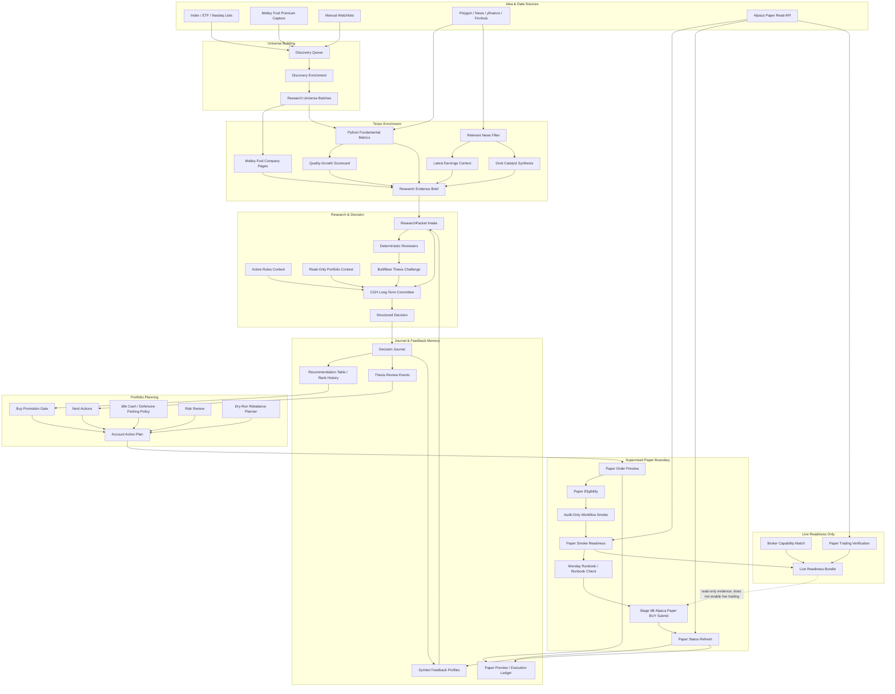
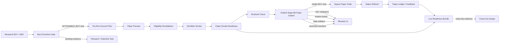

# Long-Term Trader Architecture

## System Map

## Safety Boundary

## Main Components

`research/research_packet.py`
Defines the canonical `ResearchPacket` and Lynch-style company categories.

`research/intake.py`
Normalizes raw idea dictionaries into research packets and applies portfolio profile defaults.

`research/research_evidence_brief.py`
Builds a compact, versioned research evidence brief from transient enrichment fields before a `ResearchPacket` is created. It summarizes Python fundamentals, deterministic scorecard output, latest earnings context, primary-company news, Grok catalyst synthesis, and warnings into a stable `research_evidence_brief_v1` text block. The brief is research context only: it does not change ranking, sizing, paper eligibility, broker behavior, or journal outcomes.

`portfolio/portfolio_profile.py`
Defines account-level constraints: protected symbols, benchmark, defensive parking symbol, low-risk parking symbol, duration-hedge symbol, cash symbol, and tradable capital.

`longterm/discovery.py`
Builds the upstream stock universe for research. It merges candidate rows from sources such as S&P 500/Russell/Nasdaq lists, ETF holdings, manual watchlists, quality-growth screens, and Motley Fool premium captures; scores them with a lightweight quality-growth pre-filter; then buckets them into `research_queue`, `watchlist`, or `rejected`. Discovery is not allowed to read portfolio state or create trade intents.

`longterm/discovery_sources.py`
Normalizes local universe source files into discovery candidate dictionaries. V1 supports CSV-style index/ETF files and NasdaqTrader-style pipe-delimited listings, preserving sector, market-category, and ETF/index weight notes while filtering ETF/test-issue listing rows before discovery scoring.

`longterm/discovery_enrichment.py`
Applies optional local/cacheable metric enrichment to discovery candidates before scoring. It normalizes JSON/CSV rows keyed by symbol into fields such as market cap, revenue growth, earnings growth, gross margin, return on capital, debt/equity, price trend, category leadership, valuation label, source rank, and source score. Enrichment preserves the original discovery source and remains upstream of portfolio, benchmark, account-action, and broker logic.

`longterm/discovery_cli.py`
Reads candidate JSON or local source files, optionally applies local enrichment, and emits the discovery buckets. It can also export the research-ready queue as idea-batch JSON for the existing research cycle.

`longterm/research_universe.py`
Splits research-ready universe ideas into stable batch files so the operator can work through a broad stock universe in small long-term research waves instead of sending hundreds of symbols into one cycle.

`longterm/research_campaign.py`
Tracks multi-batch research campaigns after universe batching. It creates a manifest from `research-batch-*.json` files, records pending/completed/deferred/failed/skipped status, and emits the exact supervised `run_longterm_cycle.py --idea-batch ...` command for the next pending batch. It does not run research automatically.

`longterm/research_packet_enrichment.py`
Merges local/cacheable enrichment rows into research ideas before `ResearchPacket` intake. It scores packet readiness with `completeness_score`, `completeness_bucket`, and `missing_fields`, while keeping provider-specific metrics transient unless a later decision explicitly journals them.

`longterm/grok_research_enrichment.py`
Adds a source-backed Grok catalyst synthesis layer for wider-universe names, especially when Motley Fool company pages are unavailable or thin. It accepts optional cheap factual inputs such as Finnhub snapshots, normalizes Grok's structured JSON into packet-ready business/thesis context, requires source URLs or warning flags, and labels generated scores as `model_estimate`. When filtered `relevant_news` is supplied, Grok also returns snippet-grounded `article_evidence_summaries` for the top primary-company articles; these summarize only the supplied title/summary/metadata unless a future source-reader layer provides full article text. Hard financial numbers and future Moneyball-style quant scores should be computed in Python/provider code first, then supplied to Grok as facts for narrative synthesis rather than invented by the model.

`longterm/news_relevance_enrichment.py`
Fetches or replays raw ticker news, filters price-action noise and duplicate URLs, applies a primary-company subject gate, scores long-term thesis relevance, classifies catalyst impact, and attaches a compact `relevant_news` list to research ideas. Polygon is the first live provider seam, with optional daily JSON caching and offline snapshot mode for repeatable tests. This news layer is meant to run before Grok catalyst synthesis so Grok sees only high-signal articles about the target company instead of generic headline noise or peer-only mentions.

`longterm/fundamental_metrics_enrichment.py`
Computes Fool-like financial metric sections from provider data in Python before any Grok synthesis. It normalizes growth CAGRs, TTM valuation multiples, profitability ratios, TTM financials with YoY changes, balance-sheet notes, and simple quality/valuation scores. Snapshot mode is provider-neutral and testable; an optional yfinance fetch path provides a free fallback for non-Fool tickers. These metrics are factual research context, not LLM-invented numbers.

`longterm/quality_growth_scorecard.py`
Builds a deterministic non-Fool scorecard from Python fundamentals and relevant-news context. It produces quality, growth, valuation, safety, market-attention, superscore, investing-type, drawdown-band, and score-reason fields with `basis=deterministic_model`. This closes part of the Motley-Fool-style "at a glance" gap for non-Fool tickers while keeping the scores auditable and clearly separate from proprietary Fool data.

`longterm/latest_earnings_enrichment.py`
Builds structured latest-earnings context from filtered relevant-news articles and Python fundamental metrics. It extracts the latest available quarter when visible, key financial takeaways, positive and negative thesis developments, source URLs, warnings, and confidence. This gives non-Fool tickers a Fool-like recent-earnings section while preserving source and confidence boundaries.

`longterm/research_runner.py`
Builds context sections and runs the CGH decision committee through `CheapGrokHeavy`. It includes the current `ai_trader/rules/active_rules.txt` content as `active_rules_context` for the configured long-term agents, optional read-only current portfolio holdings/cash context, plus deterministic reviews and a thesis challenge section so the final decision sees the operating rules, bull case, bear case, key risks, current exposure, and kill criteria before producing a recommendation.

`research/research_packet.py`
Defines the normalized research packet and the minimum completeness rule for deep research. Packets must have a company name, idea source, and at least one research-context field (`business_summary`, `thesis_summary`, or `source_notes`) before the cycle calls the research runner. Incomplete ideas are skipped and reported rather than sent to the LLM committee.

`longterm/orchestration.py`
Builds one dry-run cycle from manual, discovery, and optional Motley Fool ideas. It now emits `skipped_ideas` and a richer `deferred_research_queue` for incomplete packets, including missing fields and a suggested enrichment command, so skipped ticker stubs become explicit enrichment work instead of disappearing. When a journal is configured, deferred research rows are persisted for later enrichment follow-up. When portfolio state is supplied, the cycle also emits a buy-promotion markdown report before account-action planning so promotion decisions are visible alongside recommendation, next-action, rebalance, capital-alert, and account-plan artifacts.

`longterm/next_actions.py`
Creates the operator-facing dry-run next-actions report from the journal, portfolio state, review status, and benchmark guard. It elevates held positions with `broken` or `weakening` thesis state into `urgent_review_holding` rows. It also renders deferred research items from the cycle so incomplete candidate packets become visible enrichment work with missing fields and suggested discovery/enrichment commands.

`longterm/scheduler_operating_model.py`
Defines the dry-run cadence model for daily, weekly, and as-needed operator routines. It covers discovery refresh, Motley Fool intake, research batches, thesis reviews, benchmark/capital checks, next-actions/rebalance refreshes, and Grok plan review touchpoints. It is guidance and artifact generation only, not a cron engine and not broker execution.

`agent/configs/longterm_trading_agent_specs.json`
Defines the long-term CGH domain roles and presets:

- `decision_4`: default V1 committee.
- `decision_6`: expanded valuation and portfolio committee.

`longterm/reviewers.py`
Deterministic business-story, balance-sheet, quality-durability, and quality-at-reasonable-price reviewers. These do not make final decisions; they ground the CGH context. The quality-durability reviewer reflects the `Quality Investing` notes by naming durable quality patterns and common quality traps.

`longterm/thesis_challenge.py`
Builds the deterministic bull/bear thesis challenge from the research packet, reviewer support, reviewer objections, invalidation conditions, and risk flags. This borrows the useful adversarial-review idea from multi-agent trading architectures without adding another LLM call.

`longterm/review_cadence.py`
Assigns review cadence and expected holding horizon by company category and risk language.

`longterm/thesis_monitor.py`
Marks review status as `healthy`, `stale`, `weakening`, or `broken` from review cadence, supplied evidence, thesis-invalidation conditions, and common quality-durability risk language.

`longterm/review_templates.py`
Builds operator thesis-review checklists from `ResearchPacket`, review status, evidence, decision IDs, and a compact excerpt of `active_rules.txt`. This keeps human review prompts aligned with quality durability, valuation discipline, thesis breakers, and FXAIX benchmark accountability.

`longterm/decision_journal.py`
Stores decisions, structured packets, raw responses, benchmark start prices, outcome updates, recommendation table rows, review candidates, durable thesis review events, dry-run account action plans, persisted deferred research items, recommendation rank snapshots, and durable symbol feedback profiles for future paper/live reconciliation.

`longterm/report_builder.py`
Creates a markdown decision report with benchmark outcomes and a Motley-Fool-style recommendation table. `RecommendationTableBuilder` is the preferred seam for report/next-action rows: it starts from `DecisionJournal` rows, optionally hydrates volatile fields, carries shortened decision IDs for traceability, includes previous-rank / rank-movement context when snapshots exist, counts repeat recommendations by symbol, surfaces new-information notes from repeat recommendations for later profile enrichment, and does not write enrichment back into the journal.

Symbol feedback profiles are research memory, not trade authority. The journal can rebuild them deterministically from prior `BUY` / `ADD` / `HOLD` rows, auto-refresh them after new decisions, preserve paper-preview feedback, and enrich future same-symbol research ideas with repeat-count, latest-thesis, new-information notes, and paper-preview blocker context before LLM review.

`longterm/buy_promotion.py`
Reviews first-pass `BUY` / `ADD` recommendation rows before they are treated as actionable account-planning candidates. It checks protected symbols, existing holdings, confidence, positive suggested size, valuation context, and whether the packet contains a versioned evidence brief with article-level support. The output is an operator-facing promotion decision such as `ACTIONABLE_BUY`, `WATCHLIST_PENDING_EVIDENCE`, `WATCHLIST_PENDING_CONFIRMATION`, `REVIEW_EXISTING_POSITION`, `NOT_PROMOTED`, or `BLOCKED`. Account-action planning and next-actions use this gate so pending-evidence names remain research/review tasks instead of becoming dry-run buy intents or rebalance targets. This is still a dry-run review gate only; it does not place orders, mutate journal decisions, or override Stage 6B paper execution eligibility.

`longterm/buy_promotion_cli.py`
Renders buy-promotion reviews from the latest journal recommendation rows and a read-only portfolio snapshot as markdown or JSON. It is an operator report surface for inspecting which first-pass buys are ready for the next dry-run planning stage.

`longterm/recommendation_enrichment.py`
Provides `CachedRecommendationEnricher`, a daily cache wrapper for recommendation-table enrichment such as current price, daily change, market cap, revenue growth, estimated return range, and max drawdown. This keeps external data calls out of core journal storage and avoids repeated fetches during report generation.

`longterm/capital_alert.py`
Builds informational capital-needed alerts and provider-agnostic email payloads when high-conviction ideas exceed available active-sleeve cash. Alerts can be suppressed with portfolio state when an existing non-protected holding has a sell/reduce recommendation and should fund the better idea first. These payloads are not instructions to deposit funds and do not execute trades.

`longterm/risk_review.py`
Builds deterministic dry-run risk reviews for account-action intents. Reviews check protected symbols, benchmark gate state, thesis/review status, position-size warnings, and active-sleeve cash warnings before actions are surfaced as machine-readable plan intents.

`longterm/idle_cash_policy.py`
Classifies a supplied market-regime snapshot and chooses where leftover active-sleeve cash should wait after approved stock picks are sized. Normal regimes park in the configured equity index parking symbol such as `SPY`; elevated uncertainty splits parking between equity index exposure and short-duration Treasury exposure such as `SGOV`; inflation/rate-shock volatility defaults to low-risk parking; and classic equity panic with falling yields permits a capped duration hedge such as `TLT`. VIX alone is not treated as permission to buy long-duration bonds.

`longterm/live_readiness.py`
Builds a dry-run live-readiness checklist. It reports unmet gates such as benchmark proof, paper trading, broker-capability match, protected-symbol enforcement, manual approval, kill switch, audit logs, broker-read reconciliation, explicit live-mode config, and secrets hygiene. The broker-capability gate prevents Alpaca paper notional/fractional behavior from being treated as proof that a future live broker supports the same sizing model. It does not enable live execution.

`longterm/live_readiness_bundle.py`
Combines local advisory evidence into one live-readiness checklist result. It can merge a base observed file with broker capability evidence, paper-trading verification from the paper ledger, and promotion-aware paper-smoke readiness evidence. It only treats paper smoke as ready when the supplied smoke artifact is schema v2 or newer, reports ready, and has no buy-promotion blockers. It is read-only and does not enable live execution.

`longterm/broker_capabilities.py`
Builds an advisory broker-capability compatibility report between the paper simulator and an intended live API. V1 includes Alpaca paper and Schwab API profiles and can emit a `broker_capability_match` observed JSON fragment for the live-readiness checklist. It is static/read-only and does not call any broker.

`longterm/capital_alert_cli.py`
Provides a dry-run-first command surface for rendering capital-needed markdown or explicitly sending the prepared payload through the configured SMTP sender.

`longterm/email_sender.py`
Provides a Brevo-compatible SMTP sender and config loader. It reads `ai_trader/trading_agent/config/email_notifications.json` by default, is disabled unless the local ignored config enables it, and can reuse the swing-trader alert email address.

`longterm/motley_fool_intake.py`
Normalizes Motley Fool premium table rows into investigation ideas. Captured ideas preserve any per-company Motley Fool URL from the table row as `motley_fool_company_url` / `source_url` so later enrichment can revisit the ticker's Fool IQ page directly. Motley Fool is treated as a high-quality idea source, not an automatic trading authority.

`longterm/motley_fool_capture.py`
Uses the logged-in Playwright/Chrome profile to capture Motley Fool premium table payloads from full new-recommendation, analyst-ranking, AI-ranking, or dashboard pages. Table extraction preserves cell-level links alongside cell text so downstream intake can retain per-ticker source URLs.

`longterm/motley_fool_capture_cli.py`
Provides a command surface for exporting captured Motley Fool ideas as JSON. The default source set captures the full new recommendations, analyst rankings, and AI rankings pages; dashboard capture is available as a smoke test.

`longterm/motley_fool_company_enrichment.py`
Fetches and parses per-company Fool IQ pages into structured research-packet context. The default runtime backend is designed for Scrapling Stealthy with the logged-in Chrome profile, while the parser remains provider-neutral and testable from saved snapshots. It captures optional sections such as market snapshot, recommendation context, company overview, premium coverage, Moneyball scores, financial metric tables, recent earnings, and bull/bear cases; it stores structured summaries, metrics, and source URLs rather than full paid article dumps.

`longterm/motley_fool_company_enrichment_cli.py`
Provides a command surface for enriching one idea or an idea batch from captured Motley Fool company URLs. It can fetch live pages through Scrapling or read saved `CompanyPageSnapshot` JSON files for repeatable parser testing.

`config/motley_fool_capture.json`
Local scheduler-facing toggle for optional Motley Fool intake. It records
whether Fool is enabled on this machine, whether the logged-in Chrome profile is
ready, which profile to use, and which premium sources should be captured. The
real local file is ignored; `config/motley_fool_capture.example.json` is the
repo-safe template.

`longterm/motley_fool_settings.py`
Loads the optional Motley Fool config for future scheduler wiring. Missing config
is treated as disabled, `enabled=true` plus `cookie_ready=true` means scheduled
capture may run, and `enabled=true` plus `cookie_ready=false` can trigger an
interactive login/setup flow.

`longterm/review_status.py`
Builds per-symbol thesis review status from journal review candidates and the durable thesis-review event table. Newer CGH decisions take precedence over older reviews; otherwise, recorded thesis reviews supply the last-review date and can preserve a `broken` or `weakening` state until a newer decision or new evidence changes it. The builder returns review-due/thesis-state fields for recommendation tables, markdown reports, and next-action reports without mutating the journal.

`longterm/rebalance_outcome_analysis.py`
Builds read-only evidence for future review-aware rebalance tuning. It groups evaluated decision outcomes by the shared thesis/review-risk buckets (`healthy`, `review_due`, `stale`, `weakening`, `broken`, `unreviewed`), reports excess return versus `FXAIX`, beat rate, confidence-weighted excess return, and pending outcome counts. It does not change planner weights.

`longterm/action_planner.py`
Converts a structured decision into a non-executing proposed `BUY`, `SELL`, or `NONE` intent.

`longterm/account_action_plan.py`
Builds the structured dry-run account action contract that future paper/live execution should consume. It aggregates recommendation-table rows, buy-promotion review status, portfolio state, benchmark gating, capital-shortfall suppression, review status, optional idle-cash parking policy, and rebalance proposals into JSON-compatible intents (`BUY`, `PARK_IDLE_CASH`, `PARK_DEFENSIVE_CASH`, `REBALANCE`, `REVIEW`, `CAPITAL_NEEDED`, or `BLOCKED`). Non-actionable promotion reviews become review/enrichment intents with no order, and pending-evidence names are excluded as rebalance targets. It does not place orders.

`longterm/portfolio_state.py`
Loads read-only portfolio snapshots and separates active versus protected holdings.

`longterm/alpaca_paper_account.py`
Reads Alpaca paper-account state through the standard broker API, normalizes positions into a read-only snapshot, and can export the same `PortfolioState` contract used by next-actions, benchmark, rebalance, and capital-alert planning. It is paper-only and does not expose order placement.

`longterm/paper_reconciliation.py`
Compares read-only paper account state against dry-run action-plan targets, expected cash, and optional paper execution ledger events. It reports missing target symbols, extra non-protected symbols, value mismatches, protected-symbol presence, missing filled symbols, and unexpected holdings after rejected orders. It is reconciliation only and never submits orders.

`longterm/paper_account_cleanliness.py`
Checks whether a read-only paper account snapshot is reset enough for the next supervised smoke run. It flags non-protected holdings and optional cash drift from an expected cash baseline. It reads only exported portfolio-state data and never calls a broker.

`longterm/paper_smoke_readiness.py`
Combines paper account cleanliness, broker capability compatibility, optional scheduler-readiness output, and optional workflow-smoke output into a single read-only pre-flight report for supervised paper smokes. It can block on a dirty paper account, broker capability mismatch, scheduler-readiness blockers, workflow-smoke blockers, or buy-promotion blockers surfaced by the workflow. It does not submit, cancel, or modify orders.

`longterm/paper_runbook.py`
Generates an ordered, read-only Monday paper-trading runbook with expected artifact paths and commands for snapshot, workflow smoke, readiness, runbook check, Monday operator check, supervised submit, status refresh, manual cleanup reminder, paper-trading verification, live-readiness evidence, and final operator status bundle output. It can propagate a shared paper profile config into generated commands and can save the runbook JSON with `--report-output` so later artifact checks can verify submit-command redaction. The supervised submit command is redacted by default and is only printed when the operator explicitly requests `--include-submit-command`. It does not call brokers or submit orders.

`longterm/paper_runbook_check.py`
Reads saved workflow-smoke and paper-smoke-readiness artifacts and verifies they are ready before the operator runs the supervised submit command. It emits a generated timestamp, workflow plan ID, canonical action-plan hash, and buy-promotion summary so the submit CLI can reject missing, stale, mismatched, malformed, not-ready, or pre-promotion-aware evidence before refreshing broker state. It is read-only and does not call brokers or mutate ledgers.

`longterm/paper_monday_check.py`
Builds a read-only Monday operator checklist from saved runbook, workflow-smoke, paper-smoke-readiness, runbook-check, and optional status-refresh artifacts. It summarizes readiness, submit-command redaction/reveal state, action-plan hash presence, promotion-blocker counts, status errors, and paper-account cleanliness without opening broker connections. Older schema-v1 artifacts are treated as stale safety evidence after the promotion-gate upgrade.

`longterm/paper_workflow_smoke.py`
Runs an audit-only whole-share paper workflow from action plan to read-only price map, recorded preview, and paper execution audit. It also summarizes missing/non-actionable buy-promotion state so unpromoted stock BUYs block the smoke before a supervised paper submit. It does not submit orders and is meant to prove the operator artifacts are clean before a supervised paper submit.

`longterm/paper_order_preview.py`
Converts dry-run account action plan intents into broker-shaped paper order previews without importing Alpaca or submitting orders. Preview rows carry plan/decision traceability, risk/review metadata, buy-promotion review state, cash shortfall, blocked reasons, and paired rebalance transaction IDs. Stock BUY previews require `ACTIONABLE_BUY`; missing or pending promotion reviews become blocked preview rows. `order_submission_enabled` is always `false`.

`longterm/paper_trade_ledger.py`
Persists non-submitting paper preview rows with plan, preview, decision, transaction, and future trade IDs. The ledger provides durable traceability before any broker submission path exists and reserves execution-event storage for a later Stage 6B paper execution layer.

`longterm/paper_preview_status.py`
Hydrates paper preview ledger rows into read-only status maps by decision ID and symbol. Recommendation reports and next-actions can use this to show whether a candidate already has a ready, blocked, or no-order paper preview without mutating the decision journal.

`longterm/paper_execution_status.py`
Hydrates paper execution ledger events into read-only status maps by decision ID and symbol. Recommendation reports, next-actions, lifecycle, and position intelligence reports can show latest paper execution state, broker order ID, filled quantity/price, and error context without mutating original decision rows. Symbol summaries distinguish historical status-refresh error counts from whether the current/latest status is still an error.

`longterm/paper_trading_verification.py`
Builds a conservative live-readiness observed fragment for the `paper_trading_verified` gate from append-only paper execution ledger events. It requires at least one filled paper execution and no current status-refresh errors. It does not call a broker.

`longterm/paper_execution_eligibility.py`
Builds the pre-6B paper execution eligibility contract from a dry-run account action plan, the paper preview ledger, portfolio state, and protected-symbol profile. It checks decision-id traceability, buy-promotion review state for stock BUYs, preview freshness, preview ready/blocked/no-order status, explicit paper-execution gate state, protected symbols, and intent-level blockers. It does not import Alpaca and does not submit orders.

`longterm/paper_execution.py`
Provides the supervised Stage 6B Alpaca paper execution boundary. V1 submits only simple `BUY` paper previews after revalidating protected symbols, actionable buy-promotion state, benchmark guard, review/thesis state, journal decision quality, preview freshness, cash, duplicate submission state, and the active-rules hash. Rebalance/sell previews are hard-blocked with `rebalance_blocked_v1`. Execution truth is append-only in `PaperTradeLedger`; original decision rows remain immutable. The real CLI submit path requires an open Alpaca paper market clock, refreshes the Alpaca paper account snapshot before broker calls, emits a pre-flight audit, and never enables live trading or scheduler automation.

`longterm/paper_order_status_refresh.py`
Refreshes already-submitted Alpaca paper order statuses by reading broker order IDs from `PaperTradeLedger`, calling a read-only broker status API, and appending status events such as `filled`, `partially_filled`, `rejected`, or `status_refresh_error`. Its CLI can write a saved JSON status-refresh artifact for the Monday runbook, and it skips broker construction entirely when there are no submitted order IDs to refresh. It does not submit, cancel, or modify orders.

`longterm/paper_outcomes.py`
Builds provider-free paper fill outcome summaries from `PaperTradeLedger` fill events and an explicit current-price map. It compares paper fill return against `FXAIX` from the fill baseline and does not mutate journal decisions or call a broker.

`longterm/paper_lifecycle.py`
Builds a read-only symbol lifecycle summary across paper previews, paper execution events, and optional provider-free paper outcomes. It classifies symbols as preview-ready, preview-blocked, submitted, filled with pending outcome, outcome-evaluated, rejected, canceled, or status-error without submitting or modifying broker orders. Its CLI can write a saved JSON lifecycle artifact for the Monday runbook.

`longterm/feedback_refresh.py`
Runs explicit dry-run feedback maintenance. It can rebuild symbol profiles, apply paper-preview feedback, apply paper execution feedback, apply reconciliation feedback, refresh active-vs-FXAIX outcomes from explicit price maps, compute ephemeral outcome freshness, summarize review/thesis state, compute benchmark-guard context, persist idempotent eligibility evaluation events, and produce analysis-only tuning inputs. It does not mutate ranking, sizing, planner weights, or broker state.

`longterm/scheduler_readiness.py`
Builds an advisory scheduler-readiness report from existing artifacts such as portfolio state, dry-run action plans, buy-promotion state, feedback refresh summaries, paper lifecycle summaries, review/thesis state, benchmark guard state, and the active-rules reference. It blocks if a stock `BUY` order intent lacks an actionable promotion review, warns when pending promotion follow-up remains as a non-order task, and V1 always keeps `scheduler_submission_enabled=false` and `ready_for_scheduler_paper_submit=false`; it is a blocker/warning checklist only, not scheduler automation.

`longterm/operator_status_bundle.py`
Assembles a read-only operator bundle from the paper lifecycle summary, buy-promotion summary, optional Monday artifact check summary, optional live-readiness evidence summary, optional paper status-refresh summary, advisory scheduler readiness report, and position intelligence report. It also emits an `agent_next_step` rollup such as `collect_preflight_artifacts`, `blocked_preflight`, `ready_to_reveal_submit_command`, `monitor_submitted_orders`, or `review_status_errors`; this is guidance only and keeps order submission disabled. "Operator" means the current supervised human/agent control surface and the future autonomous long-term agent control surface. The bundle is meant as the pre-automation cockpit: machine-readable enough for the future agent, human-readable enough for supervised paper trading, and never a broker submission authority by itself.

`longterm/operator_dashboard.py`
Builds a static, read-only operator dashboard and optional ticker tear-sheet site from saved artifacts. It renders current advisory state, market regime, paper BUY candidates, parking guidance, portfolio holdings, rankings/actionability, universe scorecards, ticker charts, fundamentals, earnings context, and article evidence without calling brokers or LLMs. The generated site includes a disabled `Agent Desk` placeholder for future authenticated Q&A and supervised command drafting, but the placeholder cannot send messages or orders.

`longterm/position_report.py`
Builds an on-demand monthly or quarterly position intelligence report from portfolio state, the decision journal, symbol feedback profiles, review status, paper preview status, paper execution status, provider-free paper outcome summaries, outcome freshness, and optional feedback-refresh summaries. It summarizes the portfolio and then shows collected research/feedback context for each held symbol, including knowledge gaps. It can produce a Brevo-compatible email payload, but it is not scheduler-wired and does not submit broker orders.

`longterm/next_actions.py`
Combines recommendation table builder output, portfolio state, automatically-derived review status, benchmark guard, and dry-run planner into a prioritized next-actions report. When the benchmark guard pauses new buys, buy candidates are shown as paused rather than actionable. If a high-conviction idea lacks active-sleeve cash, the report surfaces a `capital_needed` alert instead of pretending the buy can proceed.

`longterm/benchmark_guard.py`
Pauses new active buys when evaluated results lag `FXAIX` enough to question the active process.

`longterm/rebalance_planner.py`
Proposes dry-run rotations from weaker non-protected holdings into stronger candidates. It honors the benchmark guard before suggesting rotations into new buy candidates.

`longterm/thesis_monitor.py`
Checks review due dates and whether current evidence matches invalidation conditions.

## Decision Flow

Universe sources -> discovery queue -> research packet enrichment -> research batches -> research campaign manifest -> `ResearchPacket` completeness gate -> deterministic reviews -> CGH committee -> parsed JSON decision -> journal -> recommendation table builder/enrichment/review status -> buy-promotion review gate -> rebalance outcome analysis -> Alpaca paper/read-only portfolio snapshot -> paper reconciliation -> benchmark guard -> dry-run account action plan -> paper order preview -> paper preview ledger -> paper execution eligibility -> supervised Stage 6B paper execution boundary -> paper order status refresh -> paper outcomes/lifecycle summaries -> feedback refresh -> scheduler-readiness checklist -> operator status bundle -> next-actions/report artifacts and on-demand position intelligence reports.

## Data Flow Safety

Broker configs, credentials, tokens, local databases, logs, and generated caches should not be committed. Live execution remains unavailable; Stage 6B is limited to explicitly requested Alpaca paper BUY submission.
